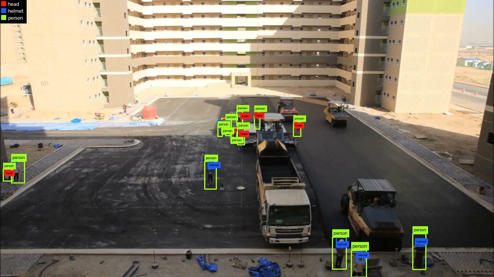

# yolo-dataset-toolkit

Cinco ferramentas de linha de comando para auditar e preparar datasets de
detecção de objetos no formato YOLO. Funcionam com **qualquer** dataset YOLO,
quaisquer que sejam as classes.



A premissa é que a qualidade de um detector se decide antes do treino. Um
dataset com anotação inconsistente, frames duplicados atravessando o split ou
caixas em coordenadas erradas produz uma métrica alta que não sobrevive a
imagens novas. Estas ferramentas existem para encontrar isso enquanto ainda dá
para corrigir.

| ferramenta | o que faz |
|---|---|
| [`yolo-visualize`](#yolo-visualize) | desenha as caixas sobre as imagens, para inspeção |
| [`yolo-validate`](#yolo-validate) | audita estrutura e regras de anotação |
| [`yolo-dedup`](#yolo-dedup) | acha imagens quase idênticas |
| [`yolo-split`](#yolo-split) | divide em train/valid/test sem vazamento |
| [`yolo-convert`](#yolo-convert) | converte entre YOLO e COCO |

O caminho típico, de um dataset anotado até um pronto para treinar:

```bash
uv run yolo-validate  --data dataset/data.yaml
uv run yolo-visualize --data dataset/data.yaml
uv run yolo-split     --data dataset/data.yaml --out dataset-split
```

O `yolo-split` já escreve um `data.yaml`, então dali em diante tudo aceita
`--data dataset-split/data.yaml`.

> **De onde este caminho continua.** Este repositório termina quando o dataset
> está pronto para treinar. O
> [canteiro-pipeline](https://github.com/Joa1G/canteiro-pipeline) começa
> exatamente aí: lê esse mesmo `data.yaml`, treina, rastreia objetos num vídeo
> e transforma permanência por zona em carta de controle. A saída de um é a
> entrada do outro.

> **Estudo de caso.** O toolkit nasceu de um problema concreto — detecção de
> EPI em canteiro de obra — e foi desenvolvido contra um dataset próprio de 278
> imagens anotadas à mão. Esse caso está documentado em
> [`docs/estudo-de-caso-epi.md`](docs/estudo-de-caso-epi.md), com os números que
> cada ferramenta produziu. Ele é o exemplo, não o escopo.

## Instalação

```bash
uv sync
```

Requer Python 3.14. As dependências são quatro: `opencv-python`, `pyyaml`,
`imagehash` e `pillow`.

## Testes

```bash
uv run pytest
```

## `yolo-visualize`

Desenha as bounding boxes de um dataset por cima das próprias imagens, para
inspeção visual das anotações.

```bash
# a partir de um data.yaml (formato YOLOv8 / export do Roboflow)
uv run yolo-visualize --data /caminho/dataset/data.yaml --split train --limit 30

# a partir de pastas soltas, sem data.yaml
uv run yolo-visualize \
    --images /caminho/train/images \
    --labels /caminho/train/labels \
    --names head,helmet,person
```

| flag | efeito |
|---|---|
| `--data` | caminho do `data.yaml`; única fonte das classes e dos splits |
| `--images` / `--labels` | pastas explícitas, alternativa ao `--data` |
| `--names` | classes separadas por vírgula; obrigatório com `--images` |
| `--split` | `train`, `valid` ou `test` (padrão: `train`) |
| `--limit` | quantas imagens processar; `0` para todas (padrão: 30) |
| `--out` | pasta de saída (padrão: `visualized/`) |
| `--color` | sobrescreve a cor de uma classe: `--color helmet=#00ff00` |
| `--thickness` | espessura da linha da caixa em pixels |
| `--no-legend` | remove a legenda de cores do canto |

Ao final imprime um resumo: quantas imagens foram escritas, quantas ficaram sem
label, quantas não puderam ser lidas e quantas tinham label malformado.

Há seis saídas comentadas em [`examples/`](examples/).

## `yolo-validate`

Audita o dataset e imprime um relatório: distribuição de classes, imagens sem
objeto e problemas encontrados.

```bash
uv run yolo-validate --data dataset/data.yaml
```

São duas famílias de checagem, e mantê-las separadas é o ponto.

**As estruturais** valem para qualquer dataset YOLO e rodam sempre, sem
configuração — uma coordenada fora de `0..1` está errada independente do que as
classes significam:

| checagem | o que pega |
|---|---|
| `fora-da-imagem` | coordenada fora de `0..1` |
| `caixa-degenerada` | largura/altura zero, ou área minúscula |
| `classe-desconhecida` | `class_id` que não existe no `data.yaml` |
| `caixa-duplicada` | mesma classe, IoU ≥ 0,9 |
| `sem-label` | imagem sem `.txt` |
| `label-ilegivel` | `.txt` que não parseia |
| `label-orfa` | `.txt` sem imagem |

**As de relação** são as convenções do *seu* dataset, e essas não dá para
adivinhar. Você as declara num arquivo, e elas só rodam quando você passa
`--rules`:

```bash
uv run yolo-validate --data dataset/data.yaml --rules rules/epi.yaml
```

### O arquivo de regras

```yaml
association: aligned

rules:
  - class: person
    contains_any: [head, helmet]
    name: person-sem-cabeca

  - class: reflective-vest
    within_any: [person]

  - exclusive: [head, helmet]
    iou: 0.5
```

Duas primitivas cobrem o que dá para checar sobre relação entre classes:

**`class` + `contains_any` / `within_any`** — toda caixa de `class` precisa
estar associada a pelo menos uma caixa de alguma das outras. A direção importa
e por isso é explícita: *"uma pessoa contém uma cabeça"* e *"uma cabeça está
dentro de uma pessoa"* descrevem o mesmo quadro mas comparam argumentos
diferentes.

**`exclusive`** — duas ou mais classes não podem descrever o mesmo objeto.
Acusa quando duas delas se sobrepõem acima do `iou` dado.

O `association` escolhe como se decide que uma caixa pertence a outra:

| valor | critério |
|---|---|
| `aligned` (padrão) | alinhada horizontalmente com a outra, e encostando nela |
| `inside` | centro dentro da outra caixa |
| `overlapping` | qualquer área em comum |

> `aligned` é o padrão porque sobrevive a anotação real. Exigir contenção por
> área rejeita, por exemplo, capacetes que claramente são da pessoa: capacete
> fica no alto da cabeça e é desenhado transbordando o corpo — num caso medido,
> 48% dele ficava fora.

Uma regra que cite uma classe que o dataset não tem é **erro**, não checagem
ignorada: passar o arquivo de regras errado tem que avisar, não validar nada e
reportar sucesso.

| flag | efeito |
|---|---|
| `--rules` | arquivo de regras de relação; sem ele, só as estruturais |
| `--limit` | quantas imagens auditar; `0` para todas |
| `--examples` | linhas mostradas por problema (padrão: 5, `0` para todas) |
| `--strict` | sai com código 1 se houver qualquer achado |

Por padrão o código de saída só é 1 quando há label ilegível, ausente ou órfã —
violação de regra é julgamento humano, não motivo para quebrar um build.

## `yolo-dedup`

Encontra frames quase idênticos — o problema específico de datasets extraídos de
vídeo, onde dois frames a um segundo de distância são arquivos diferentes com
praticamente os mesmos pixels.

```bash
uv run yolo-dedup --data /caminho/dataset/data.yaml --distance 4
```

Por padrão só relata. `--apply` apaga as sobras de cada grupo, junto com os
labels. `--distance` é a distância de Hamming entre hashes perceptuais: `0` é
idêntico depois de reduzir a imagem, e a faixa útil para frames consecutivos
fica logo acima disso.

## `yolo-split`

Divide em train/valid/test **sem quebrar grupos de imagens parecidas**.

```bash
uv run yolo-split --data /caminho/dataset/data.yaml --out dataset-split --ratios 70/20/10
```

Dividir ao acaso um dataset feito de frames de vídeo vaza: o modelo encontra o
conjunto de teste durante o treino, e a métrica sobe sem que ele tenha
aprendido nada que sobreviva a imagens novas. Por isso a unidade da divisão não
é a imagem, é o grupo de imagens parecidas, que vai inteiro para um lado só.

No [estudo de caso](docs/estudo-de-caso-epi.md) a diferença é medível: o split agrupado
deixa **0** pares quase idênticos atravessando splits, contra **33** de um
sorteio aleatório com as mesmas proporções.

| flag | efeito |
|---|---|
| `--out` | pasta onde montar a divisão (obrigatório) |
| `--ratios` | proporções `train/valid/test` (padrão: `70/20/10`) |
| `--seed` | mesma semente, mesma divisão (padrão: 0) |
| `--group-by` | `similarity` (padrão) ou `none` para sortear imagem a imagem |
| `--symlink` | cria links em vez de copiar os arquivos |

A saída já vem com um `data.yaml`, então o resultado pode ser lido de volta com
`--data` pelas outras ferramentas.

## `yolo-convert`

Converte entre YOLO e COCO, nos dois sentidos.

```bash
# YOLO -> COCO
uv run yolo-convert --data /caminho/dataset/data.yaml --out anotacoes.json

# COCO -> YOLO
uv run yolo-convert --coco anotacoes.json --out dataset-yolo/
```

Os dois formatos diferem em **duas coisas ao mesmo tempo**, e é por isso que
conversor escrito de memória sai sutilmente errado:

```
YOLO   class_id  x_center y_center w h   frações da imagem
COCO   bbox      x_min    y_min    w h   pixels
```

A âncora vai do centro para o canto superior esquerdo *e* os números deixam de
ser normalizados. Acertar uma e esquecer a outra põe cada caixa num lugar
plausível, só que errado — e isso não aparece até alguém desenhar as caixas.

Há uma terceira armadilha sem conta nenhuma: id de classe no YOLO começa em 0,
id de categoria no COCO começa em 1 por convenção. Na leitura nada é assumido —
as categorias são ordenadas por id e a **posição** vira o índice YOLO, então um
arquivo numerado de outro jeito converte igual.

Verificado nas 2160 caixas do [estudo de caso](docs/estudo-de-caso-epi.md): a maior divergência numa ida e
volta completa foi `5e-7`, que é o arredondamento de 6 casas da escrita.

| flag | efeito |
|---|---|
| `--coco` | json de entrada; presente, converte COCO -> YOLO |
| `--out` | arquivo (para COCO) ou pasta (para YOLO), obrigatório |
| `--limit` | quantas imagens converter; `0` para todas (padrão: todas) |

O COCO não carrega as imagens, só as referencia — na volta para YOLO, os
arquivos de imagem precisam ser copiados à parte.

## Organização

Uma pasta por ferramenta, mais `core/` para o que é compartilhado:

```
src/yolo_dataset_toolkit/
├── core/            o que mais de uma ferramenta precisa
│   ├── boxes.py         o tipo Box (coordenadas normalizadas), vocabulário comum
│   ├── formats.py       leitores de anotação, um por formato
│   ├── datasets.py      achar imagens e labels, ler data.yaml, resolver splits
│   ├── similarity.py    hash perceptual e agrupamento por semelhança
│   └── cli.py           os argumentos que todas as ferramentas compartilham
├── visualize/       yolo-visualize
│   ├── palette.py       N cores distintas para N classes
│   ├── rendering.py     desenhar caixas; não conhece disco nem formato
│   └── main.py
├── validate/        yolo-validate
│   ├── rules.py         checagens e parser do arquivo de regras; puro
│   └── main.py
├── dedup/           yolo-dedup
│   └── main.py
├── split/           yolo-split
│   ├── assignment.py    repartir grupos; pura e determinística
│   └── main.py
└── convert/         yolo-convert
    ├── coco.py          YOLO <-> COCO; a aritmética de âncora, escala e ids
    └── main.py
```

A regra que decide onde cada coisa mora: **`core/` é o que mais de uma
ferramenta precisa, e nenhuma pasta de ferramenta importa outra.** Foi assim que
`similarity.py` foi parar em `core/` — o `yolo-dedup` e o `yolo-split` usam os dois.

Essa regra não está só escrita aqui. `tests/test_architecture.py` lê os imports
com `ast` e falha se alguma ferramenta alcançar outra de lado — uma afirmação de
README apodrece no primeiro atalho, um teste não.

Os testes espelham a mesma divisão, então "onde está o teste disto" tem resposta
óbvia:

```
tests/
├── core/       test_boxes.py  test_similarity.py
├── validate/   test_rules.py
├── split/      test_assignment.py
├── convert/    test_coco.py
└── test_architecture.py
```

O protocolo `AnnotationReader` assume **um arquivo por imagem**, o que vale
para YOLO e para os formatos XML por imagem — para esses, adicionar suporte é
escrever a função e registrá-la no dicionário `READERS`, e nada mais muda. A
flag `--format`, que todas as cinco ferramentas aceitam, é o que escolhe entre
os leitores registrados; hoje só existe `yolo`.

COCO não cabe aí, e escrever a Etapa 5 foi o que mostrou isso: o documento é
único para o dataset inteiro e carrega as dimensões das imagens contra as
quais as caixas são medidas. Por isso COCO é conversão (`convert/coco.py`) e
não leitor. A fronteira do protocolo está desenhada onde ela realmente está, em
vez de esticada para escondê-la.

## Dados

Datasets **não** ficam versionados aqui.

O toolkit foi desenvolvido contra dois:

- [hard hat](https://universe.roboflow.com/a-ivped/hard-hat-zr6q3/dataset/1)
  (Roboflow Universe, CC BY 4.0) — 4257 imagens, 3 classes;
- um conjunto próprio de 278 frames de obra anotados à mão — 4 classes, 2160
  caixas. É o [estudo de caso](docs/estudo-de-caso-epi.md).

As imagens em [`examples/`](examples/) vêm do segundo.
