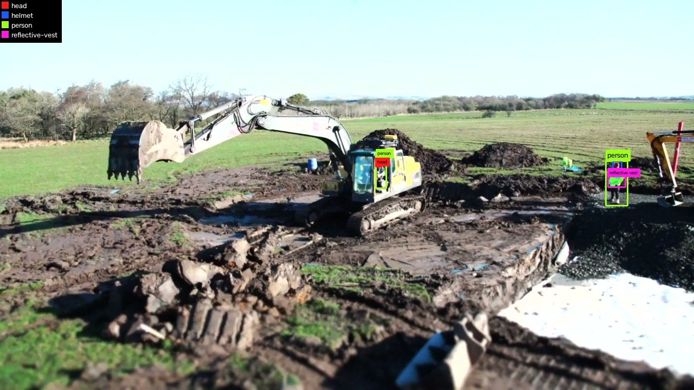
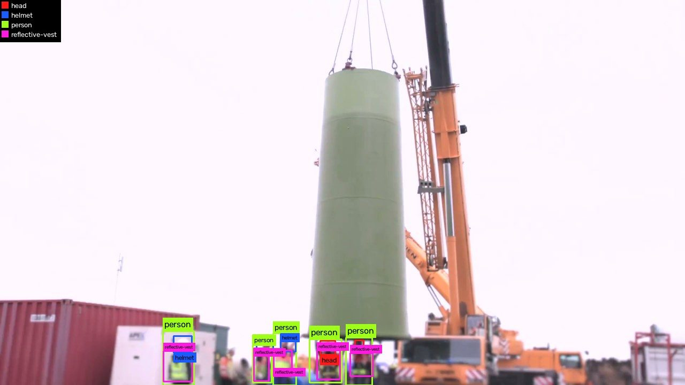
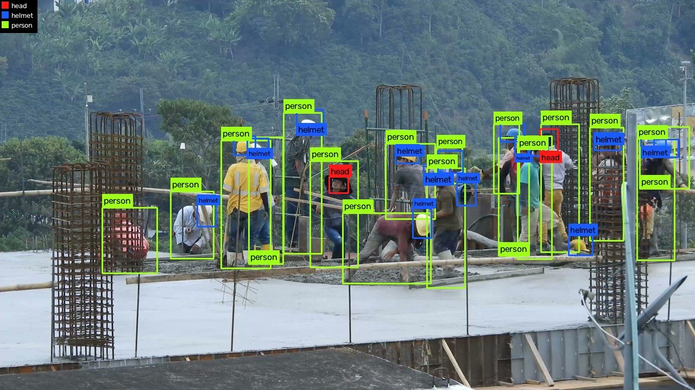
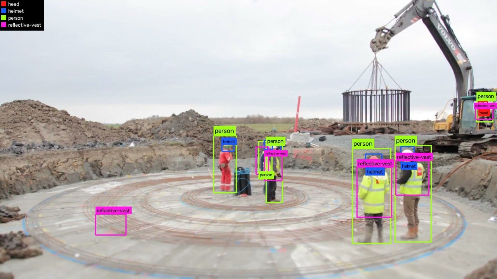

# Exemplos

Saída do `yolo-visualize` sobre o dataset anotado à mão. As imagens foram
reduzidas para 1280px antes de desenhar — como as coordenadas YOLO são
normalizadas, o mesmo `.txt` vale nos dois tamanhos.

### 01 — Operador dentro da máquina

[Regra 1](../ANNOTATION_GUIDE.md#1-pessoa-dentro-de-máquina-é-anotada-mesmo-assim):
o operador na cabine é anotado como `person` mesmo mal visível, e recebe `head`
por padrão. À direita, um trabalhador com as três classes vestidas.

### 02 — EPI completo

`person`, `helmet` e `reflective-vest` na mesma pessoa: a combinação que o
detector precisa aprender a reconhecer como "protegido".

### 03 — Cabeças sem capacete

O contraste que dá sentido ao projeto: `head` em vermelho contra `helmet` em
azul. `head` é a classe mais rara do dataset (5% das caixas) e é exatamente a
condição que o sistema existe para encontrar.

### 04 — Cena densa

35 caixas num frame 4K. O rótulo encolhe até caber na largura da própria caixa
e é omitido quando não há posição livre — daí a legenda no canto, que mantém a
cor decodificável.

### 05 — Violação: `person` sem cabeça

Achado pelo `yolo-validate`. O trabalhador agachado à esquerda tem `person` e
`reflective-vest`, mas ninguém anotou a cabeça dele — quebra a
[regra 3](../ANNOTATION_GUIDE.md#3-toda-person-tem-pelo-menos-um-head-ou-um-helmet).
Pessoas curvadas ou cortadas pela borda são onde isso acontece.

### 06 — Violação: colete sem pessoa

`reflective-vest` sem nenhuma `person` em volta, contra a
[regra 5](../ANNOTATION_GUIDE.md#5-epi-só-conta-quando-está-sendo-usado--exceto-capacete).
Ou falta anotar a pessoa, ou o colete não deveria ter sido anotado.
